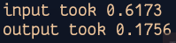
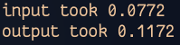

# Fast IO for pypy3 and python3
**INSTALLATION**

use 
```
pip3 install fast-IO==0.0.1
```
or [visit here.](https://pypi.org/project/fast-IO/0.0.1/)

**USAGE**

This code is tested by giving 10 million inputs
``` python3
from time import time

def main():
    start = time()
    for i in range(1,1000000):
        s = input()
    print(f"input took {time()-start:.4f}")
    
    start = time()

    for _ in range(1,1000000):
        print(end="")
    
    print(f"output took {time()-start:.4f}")

if __name__ == "__main__":
    main()
```
we get (used pypy3)



Now on using fast_IO
``` python3
from fast_IO import input, print
from time import time

def main():
    start = time()
    for i in range(1,1000000):
        s = input()
    print(f"input took {time()-start:.4f}")
    
    start = time()

    for _ in range(1,1000000):
        print(end="")
    
    print(f"output took {time()-start:.4f}")

if __name__ == "__main__":
    main()
```

this time, we get better result (used pypy3)



**CONTRIBUTE**

Contribute and make this code even faster, so that no one will suffer from TLE just because of slow I/O in python and pypy. 

<i>Use it for Competitive programming</i>